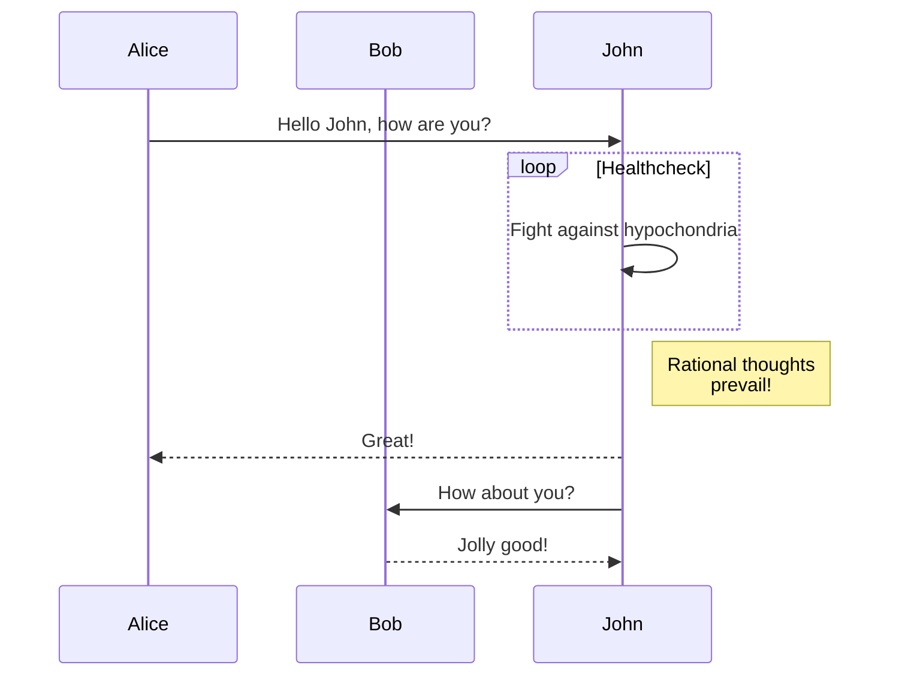

-------------

Gitbook designed to serve as an additional source of information to students of the discipline IBM3118 Embedded Systems and IoT at Ibmec.

# 1. Introduction
-------------

This Chapter presents definitions, applications, challenges, and common characteristics of Embedded Systems and Internet of Things. In addition, educational aspects of this discipline and the structure of this book are introduced.

## 1.1 Definitions

### 1.1.1 Embedded systems

### 1.1.2 Internet of things

Using a `{: .block-tip}` attribute:

```markdown
> ##### TIP
>
> This guide is last tested with @napi-rs/canvas^0.1.20, so make sure you have
> this or a similar version after installation.
```

> ##### TIP
>
> This guide is last tested with @napi-rs/canvas^0.1.20, so make sure you have
> this or a similar version after installation.
{: .block-tip }

## 1.2 Applications

Using a `{: .block-tip}` attribute:

```markdown
> ##### TIP
>
> This guide is last tested with @napi-rs/canvas^0.1.20, so make sure you have
> this or a similar version after installation.
```

## 1.3 Challenges

## 1.4 Common Characteristics

## 1.5 Conclusion

## 1.6 Problems

> ##### TIP
>
> This guide is last tested with @napi-rs/canvas^0.1.20, so make sure you have
> this or a similar version after installation.
{: .block-tip }


# 2. Hardware

Cyber-Physical Systems (CPS) rely on several key hardware components that work together to process, communicate, and act on data collected from the physical world. These components include actuators, embedded computing units, communication interfaces, and power management systems, all of which ensure the seamless integration of cyber and physical domains.

## 2.1 Models of sensors and actuators

### 2.1.1 Common sensors

Sensors are fundamental components in Cyber-Physical Systems (CPS) as they provide real-world data that enables decision-making, automation, and control. Depending on the application, different types of sensors are used to measure physical phenomena such as temperature, motion, pressure, or chemical composition. Below is a detailed explanation of common sensor types, including their working principles and applications.

Potentiometer: a sensor to measure rotation

Code to Using a `{: .block-tip}` attribute:

```arduino
// Potentiometer - code to manipulate potentiometer.

#define sensorPin A0 // define entrada analógica A0

int sensorValue = 0; // variável inteiro igual a zero
float voltage; // variável número fracionário

void setup(){
Serial.begin(9600); // monitor serial - velocidade 9600 Bps
delay(100); // atraso de 100 milissegundos
}

void loop(){
sensorValue = analogRead(sensorPin); // leitura da entrada analógica A0
voltage = sensorValue * (5.0 / 1024); // cálculo da tensão
}
Serial.print("Tensão do potenciômetro: "); // imprime no monitor serial
Serial.print(voltage); // imprime a tensão
Serial.print("Valor: "); // imprime no monitor serial
Serial.println(sensorValue); // imprime o valor
delay(500); // 500 ms delay
```

**Temperature Sensors**

Function: Measure the temperature of an environment, object, or fluid.
Types:

Thermocouples: Generate a voltage proportional to temperature differences between two junctions. Used in industrial applications, kilns, and HVAC systems.
Resistance Temperature Detectors (RTDs): Change resistance with temperature; offer high precision in laboratory and industrial settings.
Thermistors: Semiconductor devices with resistance that varies significantly with temperature. Found in household appliances, medical thermometers, and battery management systems.

> ##### Applications:
> Smart home climate control
> 
> Industrial process monitoring
> 
> Medical temperature sensing
{: .block-tip }

Pressure Sensors

Function: Measure pressure in gases or liquids, often used in industrial and automotive systems.
Types:

Piezoelectric Sensors: Convert mechanical pressure into an electrical charge; used in fuel injection systems and vibration analysis.
Strain Gauge Sensors: Detect deformation in materials due to applied pressure; commonly used in load cells.
Capacitive Pressure Sensors: Measure pressure changes by detecting variations in capacitance; used in barometric pressure monitoring and touch-sensitive devices.

> ##### Applications:
>
> Automotive (tire pressure monitoring, engine diagnostics)
> 
> Industrial process control
> 
> Weather monitoring
{: .block-tip }

Optical Sensors

Function: Detect light intensity, wavelength, or changes in illumination.
Types:

Photodiodes: Convert light into electrical current; used in fiber optic communication and ambient light sensing.
Infrared (IR) Sensors: Detect heat radiation; commonly used in motion detection and remote controls.
LiDAR (Light Detection and Ranging): Uses laser pulses to measure distance and create 3D maps; widely used in autonomous vehicles.

> ##### Applications:
> Gesture and motion recognition
>
> Industrial automation
>
> Autonomous vehicle navigation
{: .block-tip }

Inertial Sensors

Function: Measure acceleration, orientation, and angular velocity.
Types:

Accelerometers: Measure acceleration forces (e.g., gravity or movement); used in smartphones for screen orientation and in drones for stabilization.
Gyroscopes: Measure rotational motion; used in navigation systems, VR headsets, and aircraft control systems.
Magnetometers: Detect magnetic fields and are used in compasses and metal detection.

> ##### Applications:
>
> Vehicle stability control
>
> Virtual reality motion tracking
> Robotics and drone navigation
{: .block-tip }

Gas Sensors

Function: Detect the presence of gases and measure air quality.
Types:

Electrochemical Sensors: React with gases to produce an electrical signal; used for detecting toxic gases like CO and O₂.
NDIR (Non-Dispersive Infrared) Sensors: Measure gas concentrations by detecting infrared absorption; commonly used for CO₂ monitoring.
Semiconductor Sensors: Detect changes in resistance when exposed to gases like methane or alcohol.

> ##### Applications:
> 
> Indoor air quality monitoring
>
> Industrial safety and leak detection
>
> Breath alcohol analyzers
{: .block-tip }

Proximity Sensors

Function: Detect the presence of objects without physical contact.
Types:

Capacitive Sensors: Detect changes in capacitance; used in touchscreens and fluid level monitoring.
Inductive Sensors: Detect metallic objects using electromagnetic fields; used in industrial automation.
Ultrasonic Sensors: Use sound waves to measure distance; commonly found in automotive parking assistance systems.

> ##### Applications:
>
> Automated manufacturing
> 
> Smartphones and touch interfaces
>
> Robotics and automation
{: .block-tip }

Conclusion

Sensors are crucial in CPS, enabling data collection for real-time decision-making. The choice of sensor depends on the specific application, required accuracy, and environmental conditions. By integrating multiple sensors, cyber-physical systems can improve automation, safety, and efficiency in industries like healthcare, automotive, and industrial control.

Would you like me to expand on specific types of sensors, such as biometric or environmental sensors?


### 2.1.2 Actuators

While sensors collect data, actuators perform actions based on that data. Actuators convert electrical signals into mechanical, thermal, or other physical actions, making them essential for automation and control in CPS.

LED (Light-Emitting Diode) can be considered an actuator in Cyber-Physical Systems (CPS). Why is a LED an Actuator?

An actuator is any device that takes an electrical signal and converts it into a physical action. In the case of an LED:

It receives an electrical signal (voltage/current).
It converts electrical energy into light (a physical output).

Examples of LED as an Actuator in CPS:

Visual Indicators → Status indicators in IoT devices (e.g., Wi-Fi routers, industrial machines).
Automotive Systems → Brake lights and smart LED headlights in cars.
Smart Home Applications → LED lighting controlled via mobile apps or voice assistants.
Optical Communication → Infrared LEDs used in remote controls and Li-Fi technology.
Medical Applications → LEDs in pulse oximeters to measure blood oxygen levels.

Although LEDs don’t produce mechanical movement, they physically change their light output in response to an electrical signal, which qualifies them as light actuators.

## 2.2 A/D converter

### 2.2.1 Flash ADC

### 2.2.2 Successive-approximation ADC

## 2.3 D/A Converter

### 2.3.1 DAC

### 2.3.2 PWM

## 2.4 Platforms

### 2.4.1 Arduino

### 2.4.2 Raspberry

### 2.4.3 ESP-32

### 2.4.4 Smartphone as an IoT platform

## 2.5 Conclusion

# 3. Data communication protocols for IoT

## 3.1 MQTT

MQTT sequence diagram:



## 3.2 CoAP

## 3.3 AMQP

## 3.4 Comparative analysis of IoT protocols

## 3.5 Conclusion

# 4 Digital signal processing

# 5 Embedded machine learning
