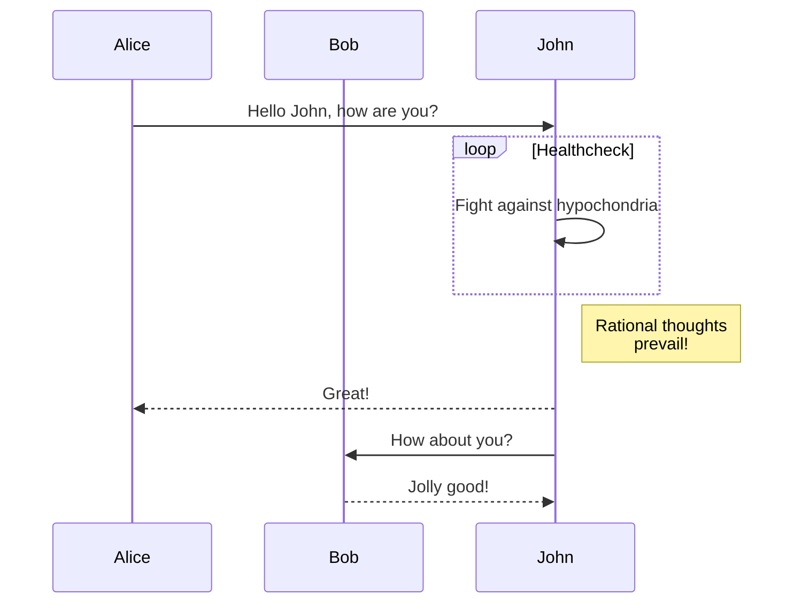

-------------

The jekyll-gitbook theme leverages [jekyll-toc][1] to generate the *Contents* for the page.
The TOC feature is not enabled by default. To use the TOC feature, modify the TOC
configuration in `_config.yml`:

```Matlab
clear; close all; clc;
    [x,fs] = audioread('file.wav');
```

# 1. Requirements, specifications, and modeling
-------------

**1.2 Continuous dynamics**

**1.2.1 Newtonian Mechanics**

**1.2.2 Actor models**

**1.2.3 Properties of systems**

**1.2.4 Feedback control**

**1.3 Discrete dynamics**

**1.3.1 The notion of state**

**1.3.2 Finite-state machines**

A state machine is a model with discret dynamics. In this model it is possible to have finite states. If the number of states is relaively small, the FSM can be represented using graphical notation. For instance, $states = \{stateA, stateB, stateC, stateD\}$

Example of a state diagram:


Sequence diagram:



**1.3.3 Extended state machines**

**1.3.4 Nondeterminism**

**1.3.5 Behaviors and traces**

**1.4 Hybrid systems**

**1.5 Composition of state machines**

**1.6 Concurrent models of computation**

**1.7 Conclusions**

long contents .....

1. a
2. b

# 2. Evaluation, validation, and optimization
-------------

**2.1 Invariants and temporal logic**

**2.2 Qualitative Analysis**

**2.3 Quantitative Analysis**

Error

Mean Error (ME)

The mean error gives a basic idea of bias in a system's predictions or outputs:

$
\text{ME} = \frac{1}{n} \sum_{i=1}^{n} (y_i - \hat{y}_i)
$

- $y_i$: true value  
- $\hat{y}_i$: estimated/predicted value  
- $n$: number of samples

Mean Squared Error

This metric penalizes larger errors more than smaller ones and is widely used:

$
\text{MSE} = \frac{1}{n} \sum_{i=1}^{n} (y_i - \hat{y}_i)^2
$

Root Mean Squared Error (RMSE)

A more interpretable version of MSE in the original unit scale:

$
\text{RMSE} = \sqrt{\text{MSE}} = \sqrt{ \frac{1}{n} \sum_{i=1}^{n} (y_i - \hat{y}_i)^2 }
$

Mean Absolute Error (MAE)

Captures average absolute deviation without squaring the errors:

$
\text{MAE} = \frac{1}{n} \sum_{i=1}^{n} |y_i - \hat{y}_i|
$

System-Level Performance Metrics

Throughput

- Number of operations, packets, or messages handled per unit of time.  
- Crucial in high-speed IoT communication scenarios.

Latency

- Time delay between input stimulus and system response.  
- Especially important in real-time embedded systems.

Jitter

- Variation in latency, often measured in milliseconds.  
- Affects synchronization and quality in multimedia or control applications.

---

Resource and Energy Efficiency

Power Consumption

- Measured in watts or milliwatts.  
- Especially relevant for battery-powered IoT devices.

Energy per Operation

$
\text{Energy per Operation} = \frac{\text{Total Energy Consumed}}{\text{Number of Operations}}
$

- Helps assess energy efficiency per task.

Memory Usage

- Includes RAM and non-volatile memory footprint.  
- Affects cost, scalability, and deployment feasibility.

---

Hardware-Specific Metrics

CPU Load

- Percentage of CPU utilization during operation.  
- Useful for load balancing and optimization.

Temperature Stability

- Evaluates whether system performance is thermally stable.  
- Crucial in rugged or remote deployments.

---

System Validation Metrics

Accuracy

$
\text{Accuracy} = \frac{\text{Correct Predictions}}{\text{Total Predictions}}
$

- Often used in classification tasks.

Precision, Recall, F1-score

- **Precision**: $ \frac{TP}{TP + FP} $  
- **Recall**: $ \frac{TP}{TP + FN} $  
- **F1-score**: Harmonic mean of precision and recall:

$
\text{F1} = 2 \cdot \frac{\text{Precision} \cdot \text{Recall}}{\text{Precision} + \text{Recall}}
$

Reliability/Uptime

- Percentage of operational time relative to total time:

$
\text{Uptime (\%)} = \left( \frac{\text{Time Online}}{\text{Total Time}} \right) \times 100
$

**2.5 Conclusion**

[1]: https://github.com/allejo/jekyll-toc
