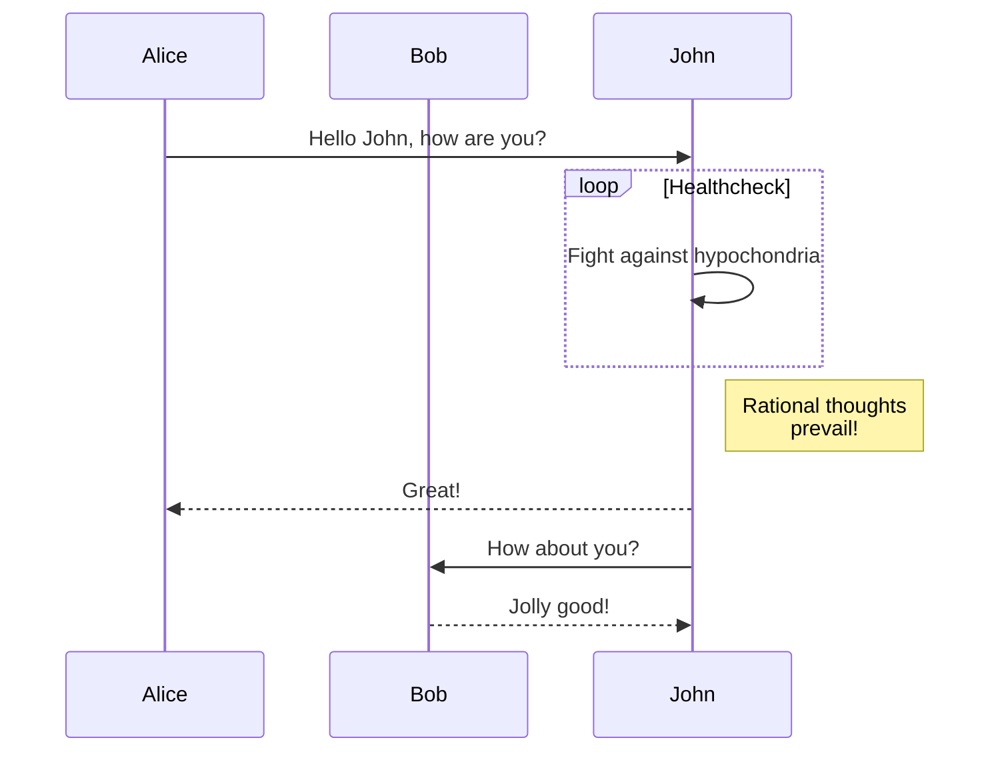

The jekyll-gitbook theme leverages [jekyll-toc][1] to generate the *Contents* for the page.
The TOC feature is not enabled by default. To use the TOC feature, modify the TOC
configuration in `_config.yml`:

```Matlab
clear; close all; clc;
    [x,fs] = audioread('file.wav');
```

# 1. Requirements, specifications, and modeling
-------------

## 1.2 Continuous dynamics

### 1.2.1 Newtonian Mechanics

### 1.2.2 Actor models

### 1.2.3 Properties of systems

### 1.2.4 Feedback control

## 1.3 Discrete dynamics

### 1.3.1 The notion of state

### 1.3.2 Finite-state machines

A state machine is a model with discret dynamics. In this model it is possible to have finite states. If the number of states is relaively small, the FSM can be represented using graphical notation. For instance, $states = \{stateA, stateB, stateC, stateD\}$

Example of a state diagram:


Sequence diagram:



### 1.3.3 Extended state machines

### 1.3.4 Nondeterminism

### 1.3.5 Behaviors and traces

## 1.4 Hybrid systems

## 1.5 Composition of state machines

## 1.6 Concurrent models of computation

## 1.7 Conclusions

long contents .....

1. a
2. b

# 2 Analysis, verification, and optimization
-------------

## 2.1 Invariants and temporal logic

## 2.2 Equivalence and refinement

## 2.3 Quantitative Analysis

## 2.4 Security and privacy

## 2.5 Conclusion

[1]: https://github.com/allejo/jekyll-toc
