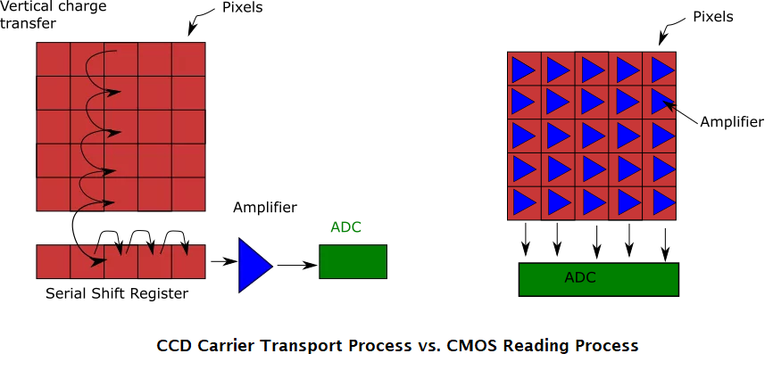

-------------

Gitbook designed to serve as an additional source of information to students of the discipline IBM3131 Computer Vision.

# 1. Introduction
-------------

This Chapter introduces concepts of computer vision.
An interdisciplinary field that combines concepts from image processing, linear algebra, and machine learning to enable machines to "see" and interpret the visual world.
From identifying objects in images to reconstructing three-dimensional scenes, computer vision has applications in various areas such as robotics, autonomous vehicles, healthcare, and security.

This course aims to introduce the fundamental principles of computer vision and allow students (with proper skills) to apply classic and modern techniques to solve practical problems.
The main topics covered include image representation, pattern recognition, preprocessing, high-level processing, and technological tools that support the development of solutions in computer vision.

By the end of the course, students are expected to:
understand the theoretical foundations of image representation and processing;
apply algorithms for object and pattern recognition;
develop practical solutions using modern tools such as OpenCV, TensorFlow, and PyTorch;
explore computer vision problems in real-world applications, such as segmentation, detection, and object classification.

# 2. Concepts of Image Representation

Image representation defines how visual information is structured and stored for processing in computer vision.
It includes (1) digital images, which describe images as pixel grids with intensity or color values and the processes for obtaining the images;
(2) color spaces, which provide different ways to represent and manipulate colors for tasks like segmentation and enhancement; and 
(3) image file formats, which determine how image data is compressed, stored, and transmitted.
Understanding these concepts is important for selecting appropriate techniques for image analysis, storage efficiency, and visual quality preservation.

**2.1 Image Formation**

Image formation is the process of capturing and representing visual information in a digital format.
This involves the physical acquisition of an image through a camera or other sensing mechanisms, the conversion of the captured signal into digital data, and the considerations related to resolution, sampling, and aliasing.In some cases, images can also be generated from non-visual data sources, such as audio signals.

**Image Formation Through a Camera**

A camera captures an image by projecting light onto a sensor, which then records the intensity and color information. The key steps in this process include:

(1) Optical Projection: Light passes through the camera lens and forms an image on the sensor. The quality of this projection depends on lens properties such as focal length, aperture, and distortion.

(2) Sensor Capture: The image sensor (CMOS or CCD) converts light intensity into electrical signals. Each sensor element (pixel) records brightness and, in color cameras, uses a Bayer filter to capture RGB values.

(3) Analog-to-Digital Conversion (ADC): The electrical signals are digitized by an ADC, resulting in a grid of pixel values that represent the image in digital form.
    
A digital image is a discrete representation of a continuous scene from the real world. It is composed of a matrix of pixels, where each pixel has an associated value indicating light intensity (in grayscale) or a combination of colors (in color images).

**2.2 Color Spaces**

A color space is a mathematical representation of colors in a way that facilitates their manipulation, processing, and analysis in computer vision.
Different color spaces define colors using different coordinate systems
Each color space can optimze a number of applications, i.e., the conversion from on color space to another one may be required depending on the computer vision task.

**Grayscale Images**

Each pixel has a value between 0 and 255, where 0 represents black and 255 represents white.

**Color Images**

Each pixel is represented by a vector with three components (R, G, B) indicating the intensities of red, green, and blue.

**Color Models**

Color models are used to represent chromatic information in images. The most common ones are:

**RGB (Red, Green, Blue)**

Additive model where colors are obtained by combining three primary colors.

**HSV (Hue, Saturation, Value)**

Model that represents color more intuitively, separating hue, saturation, and brightness.

**2.3 Image File Formats**

**JPEG**

Compresses images using lossy techniques.

**PNG**

Compresses without losing information.

**BMP**

Uncompressed format.

# 3. Preprocessing and Filters

**3.1 Preprocessing Operations**

Histogram equalization: Enhances image contrast.

Normalization: Adjusts pixel values to a standard range.

**3.2 Filters**

**3.2.1 Mean Filter**

Reduces noise by smoothing the image.

**3.2.2 Median Filter**

Removes impulse noise while preserving edges.

**3.2.3 Sobel Filter**

Detects edges in an image.

# 4. General Concepts of Pattern Recognition

**Components of Pattern Recognition**

Data acquisition: Obtaining images through sensors.

Feature extraction: Identifying relevant attributes such as edges, corners, or homogeneous regions.

Classification: Using algorithms to associate the image with a predefined class.

**Classification Algorithms**

K-Nearest Neighbors (KNN)

Support Vector Machines (SVM)

Artificial Neural Networks

# 5. Model-Based Object Recognition Methods

**Template-Based Models**

Use predefined object patterns for direct comparison with input images.

**Statistical Models**

These models use probabilistic distributions to describe object characteristics.

**Machine Learning-Based Models**

Include supervised learning techniques, such as convolutional neural networks (CNNs), which are widely used for object recognition.

# 6. High-Level Processing

**6.1 Artificial Intelligence Methodologies**

Includes the use of machine learning and deep learning techniques for image analysis.

**6.2 Object Representation**

Objects can be represented by:

**Geometric Descriptors**

Shape, size.

**Texture Descriptors**

Means, contrasts.

**6.3 Scene Representation**

Involves modeling the relationships between objects in an image.

# 7. Architectures for Computer Vision

**Centralized Architectures**

Where processing is done on a single device.

**Distributed Architectures**

Where multiple devices share the processing tasks.

**Examples of Systems**

Embedded systems (smart cameras)

Distributed systems (networks of visual sensors)

# 8. Technologies and Tools

**Technologies**

**OpenCV: A widely used open-source library for image processing.**

**TensorFlow and PyTorch: Popular frameworks for deep learning model training.**

**MATLAB: A powerful tool for data analysis and image processing.**

**Tools**

**LabelImg**

Tool for labeling images.

**YOLO**

Real-time object detection algorithm.

**Dlib**

Library for machine learning applications, including face detection.

Suggested Exercises

Exercises

Exercise 1

Implement a Sobel filter for edge detection in an image.

Exercise 2

Train a KNN classifier to identify different types of objects in images.

Exercise 3

Use the OpenCV library to segment objects in a scene using thresholding.

Exercise 4

Build a simple convolutional neural network using PyTorch for image classification.
