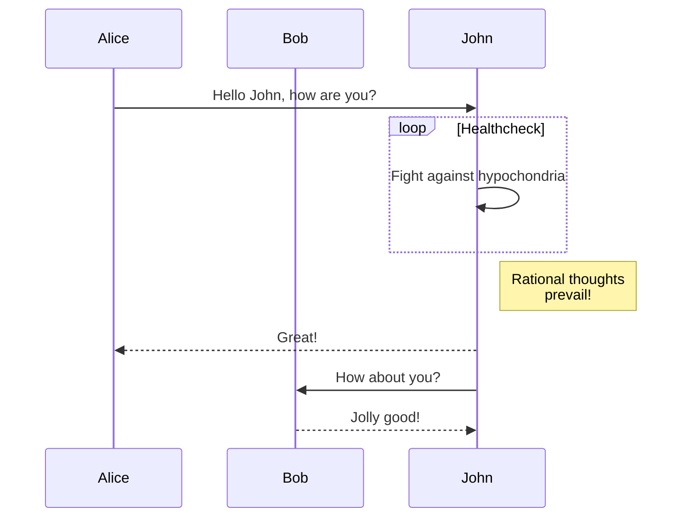

-------------

Gitbook designed to serve as an additional source of information to students of the discipline IBM3118 Embedded Systems and IoT at Ibmec.

# Chapter 1: Introduction
-------------

This Chapter presents definitions, applications, challenges, and common characteristics of Embedded Systems and Internet of Things. In addition, educational aspects of this discipline and the structure of this book are introduced.

## Definitions

### Embedded systems

### Internet of things

Using a `{: .block-tip}` attribute:

```markdown
> ##### TIP
>
> This guide is last tested with @napi-rs/canvas^0.1.20, so make sure you have
> this or a similar version after installation.
{: .block-tip }
```

> ##### TIP
>
> This guide is last tested with @napi-rs/canvas^0.1.20, so make sure you have
> this or a similar version after installation.
{: .block-tip }

## Applications

Using a `{: .block-tip}` attribute:

```markdown
> ##### TIP
>
> This guide is last tested with @napi-rs/canvas^0.1.20, so make sure you have
> this or a similar version after installation.
{: .block-tip }
```

## Challenges

## Common Characteristics

## Conclusion


## Problems

> ##### TIP
>
> This guide is last tested with @napi-rs/canvas^0.1.20, so make sure you have
> this or a similar version after installation.
{: .block-tip }


# Chapter 2:  Hardware

## Models of sensors and actuators

### Common sensors

### Actuators

## A/D converter

### Flash ADC

### Successive-approximation ADC

## D/A Converter

### DAC

### PWM

## Platforms

### Arduino

### Raspberry

### ESP-32

### Smartphone as an IoT platform

## Conclusion

# Chapter 3: Data communication protocols for IoT

## MQTT

MQTT sequence diagram:



## CoAP

## AMQP

## Comparative analysis of IoT protocols

## Conclusion

# Chapter 4: Digital signal processing

# Chapter 5: Embedded machine learning
