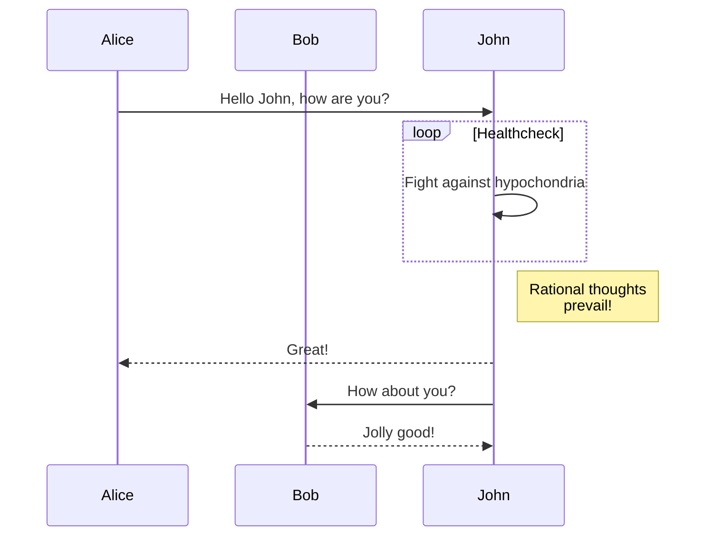

The jekyll-gitbook theme leverages [jekyll-toc][1] to generate the *Contents* for the page.
The TOC feature is not enabled by default. To use the TOC feature, modify the TOC
configuration in `_config.yml`:

```yaml
toc:
    enabled: true
```

Chapter 1: Introduction
-------------

long contents .....

1. a
2. b
3. c
4. d

### Sub title 1

### Sub title 2

### Sub title 3

Chapter 2: Sensors
-------------

long contents .....

1. a
2. b
3. c
4. d

### Sub title 1

### Sub title 2

### Sub title 3

Chapter 3: Actuators
-------------

long contents .....

1. a
2. b
3. c
4. d

### Models of computation

Example of a state diagram:


Sequence diagram:

```
sequenceDiagram
    participant Alice
    participant Bob
    Alice->>John: Hello John, how are you?
    loop Healthcheck
        John->>John: Fight against hypochondria
    end
    Note right of John: Rational thoughts <br/>prevail!
    John-->>Alice: Great!
    John->>Bob: How about you?
    Bob-->>John: Jolly good!
```



### Sub title 2

### Sub title 3

Appendix 3: Embedded System for Acoustics
-------------

long contents .....

1. a
2. b
3. c
4. d

### Sub title 1

### Sub title 2

### Sub title 3

[1]: https://github.com/allejo/jekyll-toc
