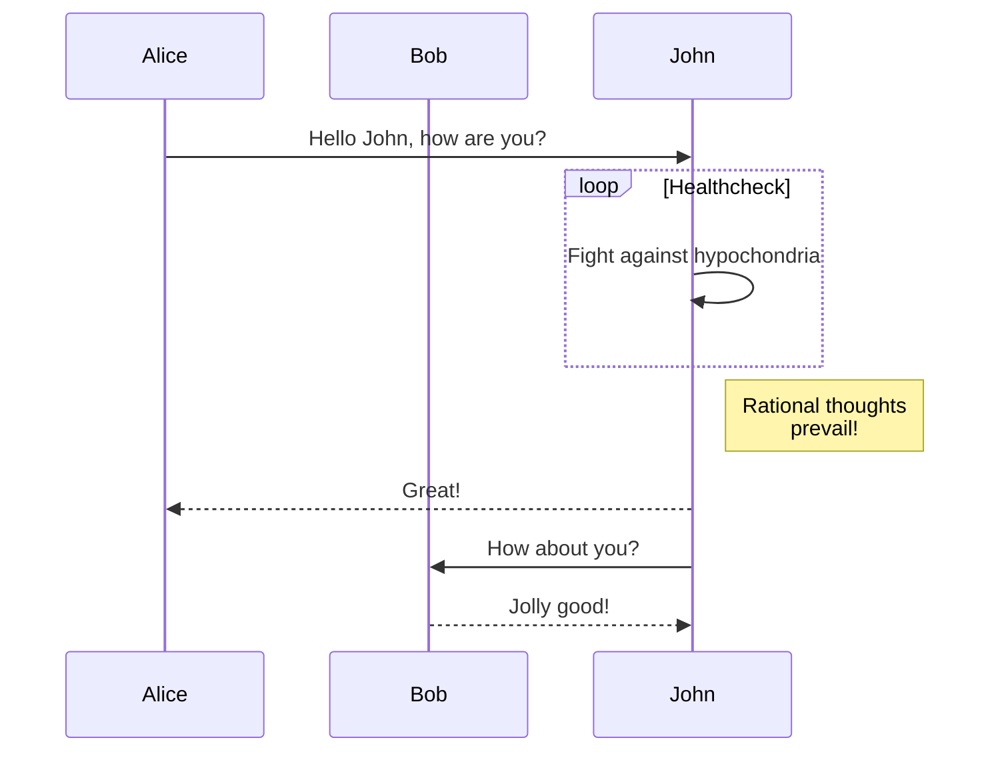

The jekyll-gitbook theme leverages [jekyll-toc][1] to generate the *Contents* for the page.
The TOC feature is not enabled by default. To use the TOC feature, modify the TOC
configuration in `_config.yml`:

```Matlab
clear; close all; clc;
    [x,fs] = audioread('file.wav')
```

# Chapter 1: Requirements, specifications, and modeling
-------------

## Continuous dynamics

### Newtonian Mechanics

### Actor models

### Properties of systems

### Feedback control

## Discrete dynamics

### The notion of state

### Finite-state machines

Example of a state diagram:


Sequence diagram:



### Extended state machines

### Nondeterminism

### Behaviors and traces

## Hybrid systems

## Composition of state machines

## Concurrent models of computation

## Conclusions

long contents .....

1. a
2. b

# Chapter 2: Analysis, verification, and optimization
-------------

## Invariants and temporal logic

## Equivalence and refinement

## Quantitative Analysis

## Security and privacy

## Conclusion

[1]: https://github.com/allejo/jekyll-toc
